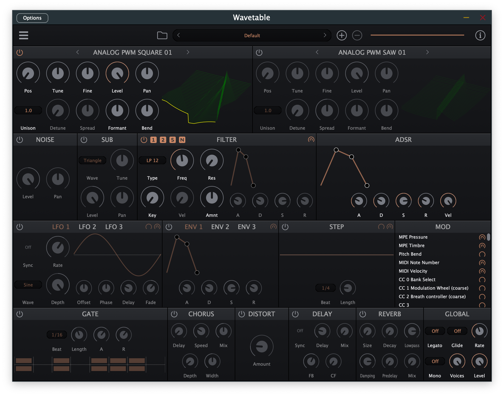

# Wavetable
Wavetable VST3 / AU / LV2 plugin

A 2 oscillator wavetable synth with flexible modulation options.

[Download](https://github.com/FigBug/Wavetable/releases)

[Product page](https://socalabs.com/synths/Wavetable/)

My synth is BSD licensed, however it depends on JUCE. To use in a commercial application, you must have a JUCE license. Wavetables have their own license. 

Need addition features or help integrating, contact me for consulting services: https://rabiensoftware.com/
